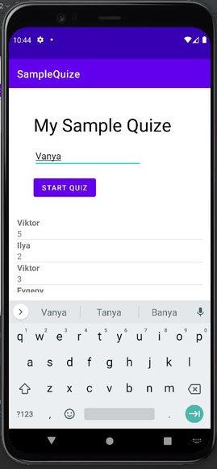

# java-android-simple-quize

## Technologies used
- SQLite
- Java
- IDE Android Studio
- Android SDK 24

## Implemented functionality
- viewpager
- skiping qestion with a swipe
- leaderboard

<h2>Testing on Android 10 - Xiaomi Redmi Note 8 and Pixel 4</h1>

Compatible with Android 4.1
